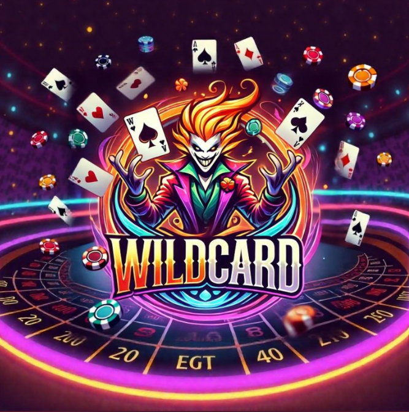
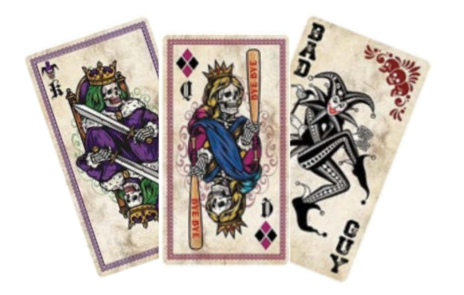
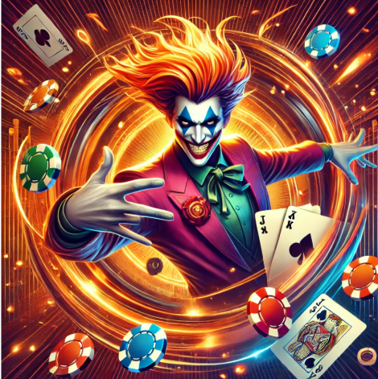
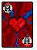

# WILDCARD

 

1. [Introducción y Objetivos](#introducción-y-objetivos)
2. [Descripción del Juego](#descripción-del-juego)
3. [Tecnologías Utilizadas](#tecnologías-utilizadas)
4. [Bibliografía](#bibliografía)
5. [Anexo](#anexo)
6. [Conclusión](#conclusión)
7. [Avances Implementados](#avances-implementados)
   - [Creación de la Narrativa y Conceptual](#creación-de-la-narrativa-y-conceptual)
   - [Actualización Tecnológica](#actualización-tecnológica)
   - [Nuevas Mecánicas de Juego](#nuevas-mecánicas-de-juego)
8. [Actualizaciones a Secciones Existentes](#actualizaciones-a-secciones-existentes)

---

## Introducción y Objetivos

Es un proyecto basado en la creación de un juego de cartas en Java, en el que los jugadores deben formar la mejor mano de póker posible, pero con un toque único de cartas comodín Wild que alteran el curso de la partida. A diferencia del póker tradicional, las cartas Wild tienen poderes especiales que permiten robar cartas, cambiar el valor de una carta en la mano, o incluso duplicar el valor de una mano, lo que agrega una capa de estrategia y sorpresas al juego.

El objetivo principal es brindar una experiencia lúdica inmersiva y accesible, diseñada para entretener y desafiar tanto a principiantes como a expertos en juegos de cartas. A través de su diseño y mecánicas, WildCard destaca por:

- Implementar las reglas fundamentales del póker de manera clara y funcional.
- Incorporar elementos creativos para personalizar la experiencia, como animaciones, efectos visuales y dinámicas novedosas.
- Incluir una IA adaptable que permita a los jugadores enfrentarse a oponentes virtuales con distintos niveles de habilidad.
- Crear una interfaz gráfica moderna y sencilla, utilizando JavaFX o Swing, que optimice la experiencia del usuario.

---

## Descripción del Juego

Es un juego de cartas basado en el póker, pero con una variación importante: el uso de cartas comodín Wild que alteran las reglas de la partida.

Al inicio, cada jugador recibe dos cartas ocultas, y las cartas comunitarias se descubren en la mesa durante tres fases del juego. Además, durante la partida, las cartas Wild pueden aparecer en cualquier momento, lo que añade un elemento impredecible. Estas cartas tienen poderes especiales como:

- **Robar** una carta de otro jugador.
- **Cambiar** el valor de una de tus cartas.
- **Duplicar** el valor de tu mano.
- **Jokers**: Las cartas Joker son comodines especiales que introducen tanto ventajas como desventajas.

El objetivo sigue siendo formar la mejor mano de póker, pero las cartas Wild crean un entorno mucho más dinámico y emocionante.

---

## Tecnologías Utilizadas

- **Java**: El lenguaje de programación utilizado para crear el juego. Es potente, flexible y perfecto para este tipo de proyectos.
- **JavaFX/Swing**: Las herramientas para crear la interfaz gráfica. Con ellas, diseñaremos una experiencia visual clara y atractiva.
- **Algoritmos de IA**: Para crear oponentes controlados por computadora con diferentes niveles de dificultad, que se adapten a tus estrategias y mantengan el desafío alto.
- **Visual Studio Code**: El entorno de desarrollo elegido por su flexibilidad y herramientas integradas.
- **Extension Pack for Java**: Lo necesario para programar, depurar y ejecutar proyectos en Java de forma eficiente.

---

## Bibliografía

Para el desarrollo de este proyecto se han utilizado diversos recursos tanto académicos como en línea. A continuación, se listan las fuentes más relevantes:

- [Oracle Java Documentation](https://docs.oracle.com/en/java/)
- [JavaFX Documentation](https://openjfx.io/)
- [Swing Documentation](https://docs.oracle.com/javase/tutorial/uiswing/)
- [W3Schools](https://www.w3schools.com/java/)
- [Stack Overflow](https://stackoverflow.com/)

---

## Anexo

A continuación, se podría incluir una captura de pantalla representativa de la interfaz del juego WildCard, mostrando las cartas y la visualización general del juego.

### Código Fuente Completo

A continuación, se encuentra el código fuente de todo el proyecto WildCard. Puedes descargar el archivo completo para ver cómo se implementa la lógica del juego, las cartas Wild y Joker, y el funcionamiento de la inteligencia artificial.

**[Descargar código fuente completo de WildCard](https://www.ejemplo.com)**

---

## Conclusión

No solo es una variación del póker tradicional, sino que aporta mecánicas innovadoras que enriquecen la experiencia de juego. Las cartas comodín Wild y los Jokers introducen un nivel de imprevisibilidad y estrategia que hace que cada partida sea única y emocionante. Estos elementos permiten a los jugadores experimentar giros sorprendentes, creando una atmósfera dinámica y desafiante.

Además de las mecánicas del juego, se ha integrado una programación avanzada en Java, lo que permite crear una experiencia fluida y accesible. Gracias a herramientas como JavaFX y Swing, la interfaz gráfica es atractiva y funcional. El uso de algoritmos de IA también ofrece una jugabilidad interesante, permitiendo que los jugadores se enfrenten a oponentes con diversos niveles de habilidad.

En resumen, **WildCard** es un juego que ofrece más que solo ganar: se trata de adaptarse, planificar, y disfrutar de los giros inesperados que ofrece el juego.

---

## Avances Implementados

### Creación de la Narrativa y Conceptual

- **Historia y Ambientación**:
  - Mundo distópico donde las cartas representan demonios internos del protagonista Jack.
  - Narrativa psicológica con 5 niveles simbólicos: Negación, Ira, Negociación, Depresión, Redención.
  - Sistema de corrupción: Cada victoria en el juego degrada visualmente al personaje.

*(Inspirado en Balatro y The Binding of Isaac)*

### Actualización Tecnológica

| **Componentes** | **Tecnología** | **Justificación** |
|----------------|--------------|-----------------|
| Motor | Pygame | Ideal para desarrollo rápido en 2D y gestión de sprites |
| Gráficos | Pixelorama & PIL | Creación de pixel art |
| Datos | MongoDB | Almacena el progreso del jugador |
| Código | Python | Sencillez |

#### Ventajas de Python sobre Java:

- Mayor ecosistema de librerías para desarrollo rápido.
- Sencillez a la hora de leer el código.

### Nuevas Mecánicas de Juego

- **Sistema de Combate Mejorado**:
  - Manos de póker desbloquean habilidades especiales.
  - Cartas malditas con efectos permanentes.
  - Sistema de apuestas con consecuencias narrativas.

- **Innovaciones Técnicas**:
  - Generación procedural de mazos usando algoritmos *Wave Function Collapse*.
  - Implementación de shaders GLSL para efectos de corrupción visual.

---

## Actualizaciones a Secciones Existentes

**Tecnologías Utilizadas (Actualizado):**

- Python 3.11 + Pygame 2.5
- MongoDB Atlas para persistencia de datos
